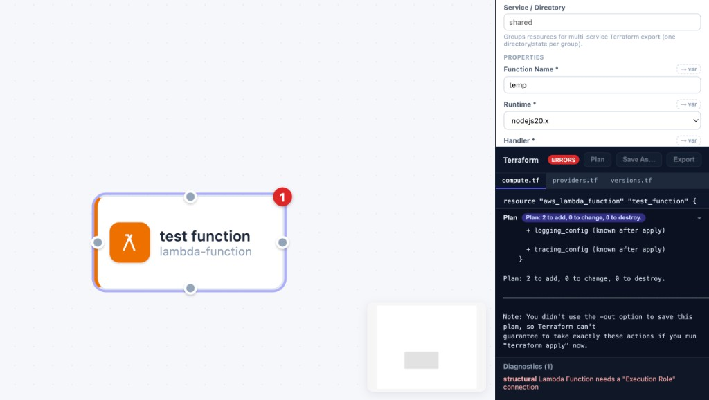
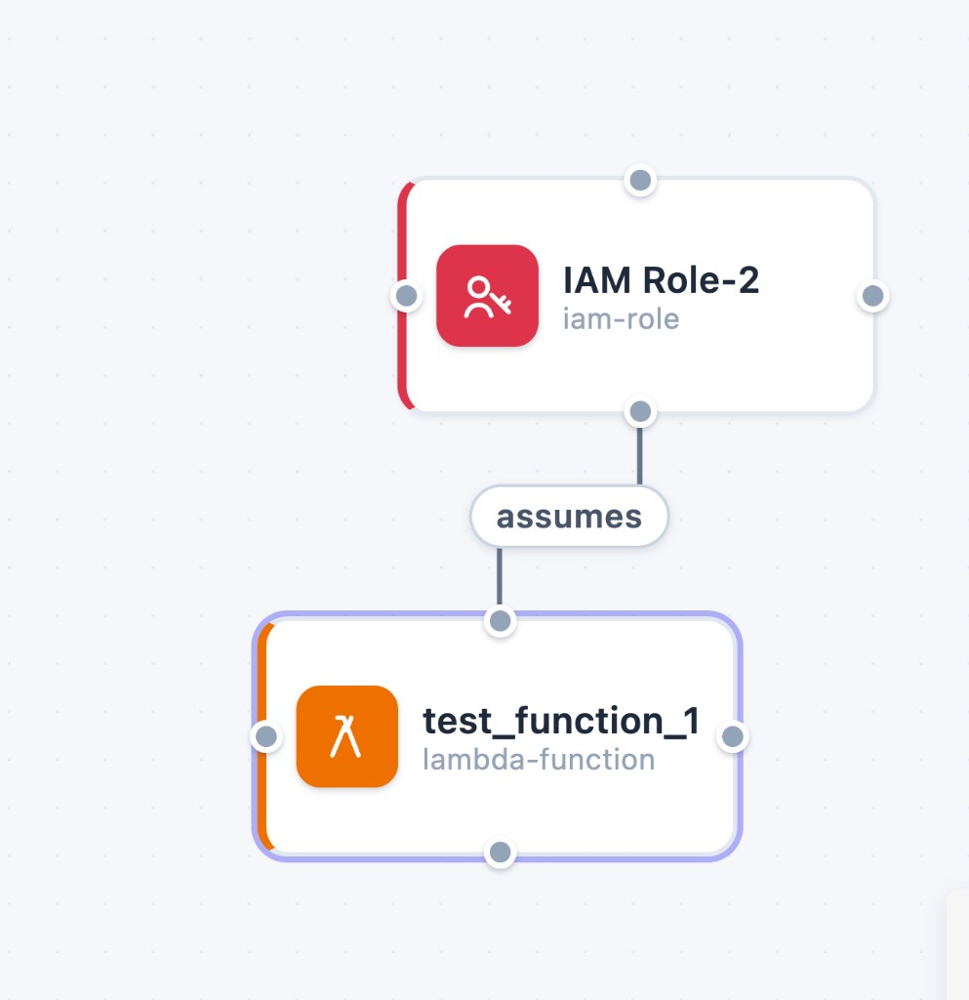

# Archviz

Open-source visual infrastructure builder that generates idiomatic Terraform (HCL) from a node-and-edge cloud architecture diagram.

## Packages

| Package | Description |
|---------|-------------|
| `@archviz/schema` | Meta-schema types, `defineResource()`, ResourceRegistry |
| `@archviz/core` | Document model, constraint engine, validator |
| `@archviz/provider-aws` | AWS resource definitions (22 common resources) |
| `@archviz/codegen` | Terraform HCL generator + materializers |
| `@archviz/runner` | Local companion CLI that runs `terraform plan` for the studio |
| `@archviz/studio` | Visual editor (React Flow + XState) |

## Getting started

```bash
pnpm install
pnpm build
pnpm --filter @archviz/studio dev
```

Open http://localhost:5173 — drag resources from the palette onto the canvas (nest Subnets inside VPCs, EC2 inside Subnets), connect handles, edit properties, and export `main.tf`.

## Contributing

Pick an open item on the [Archviz AWS coverage](https://github.com/orgs/codeupllc/projects/1) board (prefer `P0` / `good first issue`), follow [CONTRIBUTING.md](CONTRIBUTING.md), and for AWS nodes use [`.cursor/skills/add-aws-resource/SKILL.md`](.cursor/skills/add-aws-resource/SKILL.md) + [`docs/aws-coverage.md`](docs/aws-coverage.md). Open a PR with `Fixes #<n>`.

## Development

```bash
pnpm test        # run all package tests
pnpm typecheck   # type-check all packages
pnpm build       # build all packages + studio

# generate a diagram using every resource type and check the HCL with real
# Terraform (needs terraform on PATH; also runs in CI)
node scripts/validate-fixture.mjs tmp/tf-fixture
```

`scripts/validate-fixture.mjs` builds the all-resources fixture (`buildAllResourcesDocument()` in `@archviz/codegen`) and runs `terraform init -backend=false`, `terraform validate`, and `terraform fmt -check` against the output. That's the guardrail against a resource definition silently omitting an argument Terraform requires — if you add or change a resource, add it to the fixture.

## Architecture highlights

- **Single source of truth**: resource constraints live in TypeScript definitions (`defineResource`). The UI constraint engine and the Terraform generator both read the same registry.
- **Semantic document**: `@xstate/store` holds the graph; React Flow and HCL are derived projections.
- **Editor modes**: XState v5 statechart tracks connecting / dragging / editing gestures.
- **Local-first, multi-diagram**: every diagram is its own project, autosaved to `localStorage` under its own slot. The "Diagrams" button in the toolbar opens a browser of all saved diagrams (rename, duplicate, delete, switch), "New" starts a fresh one without discarding the current one, "Import" loads an `.archviz.json` file as a new diagram, and "Download" exports the current diagram as a portable `.archviz.json` file. Export is blocked while validation errors remain.
- **Terraform export**: "Export .tf" always writes the *current* live-preview HCL/files (shown in the right-hand Terraform panel, with tabs when there's more than one file). A toolbar dropdown picks the export layout:
  - **Single file** — everything in `main.tf`. Uses the File System Access API to pick a location once ("Save As…" to change it later) and silently overwrite it on later exports; other browsers fall back to a normal download.
  - **By category** — best-practice split into `versions.tf`, `providers.tf`, `variables.tf`, `network.tf`, `compute.tf`, `database.tf`, `storage.tf`, `security.tf`, `outputs.tf`. Uses the directory-picker API (or falls back to downloading each file).
  - **Multi-service directories** — partitions resources by the "Service / Directory" field in the properties panel into independent root modules (`network/`, `api/`, `shared/`, …), each with its own by-category files. References that cross a service boundary become `data "terraform_remote_state"` lookups (with a `# TODO: configure backend` stub) instead of same-state traversals, and a generated top-level `README.md` documents the layout and naming convention.
- **Secrets & variables**: connect a Secrets Manager Secret or SSM Parameter to a database's "Password from Secret" relationship instead of typing a password into a property — the generator emits a `random_password`/sensitive `variable` + `aws_secretsmanager_secret_version` and wires the consumer to it. Any property can also be promoted to its own `variable` via the "→ var" toggle next to its field.
- **Auto-arrange**: one click in the toolbar packs children into their containers, sizes containers to fit, and lays the top level out in a grid. It's deterministic (same diagram → same arrangement), only runs when you ask, and is a single undo step.

## AWS resources

VPC, Subnet, Internet Gateway, EC2, Security Group, RDS Instance (Postgres/MySQL/MariaDB/Oracle/SQL Server), Aurora Cluster + Aurora Instance, ElastiCache (Redis/Memcached), S3, ALB, NLB, Target Group, Lambda, DynamoDB, IAM Role, ECR Repository, ECS Cluster/Task Definition/Service, Secrets Manager Secret, SSM Parameter, SQS Queue, SNS Topic, API Gateway HTTP API, CloudWatch Log Group.

Most resources require a parent container (e.g. Subnet needs a VPC, EC2 needs a Subnet) — the palette shows a "needs X first" hint on anything that can't be placed yet, and the canvas highlights valid drop targets while you drag.

Some Terraform arguments can only come from a connection, so those connections are validated as required rather than silently omitted. An ALB, for example, needs subnets in two Availability Zones — nest it in one Subnet and use "Also spans Subnet" connections for the rest; with only one the export carries a warning comment.

### Worked example: a Lambda that can't exist yet

Terraform requires `role` on `aws_lambda_function`, and that ARN can only come from a connection to an IAM Role. Drop a Lambda on its own and the diagram says so before you ever run Terraform:



Three things happen at once: the node gets an error badge, **Plan** and **Export** are disabled behind an `ERRORS` badge, and Diagnostics explains exactly what's missing — *"Lambda Function needs a 'Execution Role' connection"*. That's deliberately not a silently-incomplete `.tf` file: without the connection the generator has no ARN to emit, so the alternative would be HCL that fails at plan time with `The argument "role" is required, but no definition was found`.

Draw the `assumes` connection to an IAM Role and the error clears — the badge disappears, `role = aws_iam_role.<name>.arn` appears in the generated HCL, and Plan/Export re-enable:



The same idea powers the ECS secrets wiring below: connecting a secret makes the generator emit both the `valueFrom` reference *and* the IAM policy the execution role needs, because it can see the whole relationship rather than a lone property value.

### Docker / ECS

Archviz never runs `docker build`/`push` itself — it only models the pieces Terraform needs: connect an ECS Task Definition's "Pulls image from" relationship to an ECR Repository, and set the image tag your CI pipeline pushes. The generator synthesizes the task's `container_definitions` JSON (image, port, log config) and a companion CloudWatch Log Group; actual image builds stay in your CI pipeline.

The full ECS wiring, connection by connection:

| Connection (drawn on canvas) | Generated Terraform |
|---|---|
| ECS Service *nested inside* ECS Cluster | `cluster = aws_ecs_cluster.<name>.id` |
| ECS Service —`runs task`→ Task Definition | `task_definition = aws_ecs_task_definition.<name>.id` |
| ECS Service —`runs in`→ Subnet (one per subnet; use 2+ for multi-AZ) | `network_configuration { subnets = [...] }` |
| ECS Service —`attached to`→ Security Group | `network_configuration { security_groups = [...] }` |
| ECS Service —`connects to`→ RDS / anything with a network-service capability | paired security-group ingress/egress rules |
| Task Definition —`pulls image`→ ECR Repository | `image = "${aws_ecr_repository.<name>.repository_url}:<tag>"` inside `container_definitions` |
| Task Definition —`injects secret`→ Secrets Manager Secret / SSM Parameter | `secrets = [{ name = "DB_SECRET", valueFrom = <arn> }]` inside `container_definitions`, plus an `aws_iam_role_policy` on the connected Execution Role granting read access to exactly those ARNs |

An ECS Service intentionally *cannot* be nested inside a Subnet: a Fargate service usually spans several subnets (one per AZ), which containment can't express — that's what the `runs in` connections are for. The cluster is the parent because that's the one true 1:1 relationship in AWS.

### Secrets example

To give an RDS instance a password that never appears in source code:

1. Drop a **Secrets Manager Secret** on the canvas. Its "Source" property picks where the value comes from: `generated-password` (default) or `variable`.
2. Draw a connection from the **RDS Instance** to the secret — the "Password from Secret" (`uses-secret`) relationship.

With `generated-password`, the export contains:

```hcl
resource "random_password" "db_secret_password" {
  length  = 20
  special = true
}

resource "aws_secretsmanager_secret" "db_secret" {
  name = "db-secret"
}

resource "aws_secretsmanager_secret_version" "db_secret_version" {
  secret_id     = aws_secretsmanager_secret.db_secret.id
  secret_string = random_password.db_secret_password.result
}

resource "aws_db_instance" "rds_instance" {
  # ...
  password = random_password.db_secret_password.result
}
```

With `variable`, the generator instead emits a `sensitive` input variable (`variable "db_secret_value" { sensitive = true }`) that you provide via `terraform.tfvars` or `TF_VAR_db_secret_value`, and wires both the secret version and the consumer to it. SSM Parameters work the same way through the same `uses-secret` relationship.

ECS Task Definitions use the same `uses-secret` connection but materialize it differently: instead of wiring the plaintext value, the generator adds a `secrets` entry (`valueFrom = <secret/parameter ARN>`) to `container_definitions` — the ECS agent resolves it into an env var at task start, so the value never appears in the task definition, plan output, or ECS console — and grants the connected Execution Role `secretsmanager:GetSecretValue` / `ssm:GetParameters` on exactly those ARNs. The env var name is derived from the resource name (`db-secret` → `DB_SECRET`). If no Execution Role is connected, the export carries a `# WARNING` comment on the task definition, since ECS can't pull secrets without one.

Independently of secrets, any property can be promoted to a Terraform `variable` with the "→ var" toggle next to its field in the properties panel.

## Plan from the UI

The studio can run `terraform plan` for you via a small local companion, since the browser itself can't execute binaries or hold AWS credentials. Start the runner and point it at a root folder for plan workspaces:

```bash
pnpm runner                       # repo root: uses ./terraform-out (gitignored)
pnpm runner --dir <some-folder>   # or any folder you like
```

The runner loads env from (first match wins per key; shell env always wins):

1. `./.env` (cwd)
2. Archviz repo-root `.env`
3. Sibling `../archviz-enterprise/.env` (if present)

See [`.env.example`](.env.example). For LocalStack trial / current images:

```bash
# archviz/.env  — or archviz-enterprise/.env (also loaded)
LOCALSTACK_IMAGE=localstack/localstack:latest
LOCALSTACK_AUTH_TOKEN=ls-...
```

The runner binds to `127.0.0.1:4180` (OSS Studio `:5173` and Enterprise Studio `:5174` origins are allowed) and uses your local `terraform` binary and AWS credentials — nothing sensitive ever reaches the browser. Once it's running, the **Plan** button in the studio's Terraform panel lights up. Clicking it:

- **Plans each diagram in its own workspace** — `<root>/<diagram-name-slug>/` — so state, provider caches, and tfvars never cross-contaminate between projects. The runner keeps a `.archviz-manifest.json` per workspace, deletes *its own* stale generated files on re-plan (e.g. `database.tf` after you remove the last database node), never touches files you put there (backend config, tfvars), and warns if a different diagram targets the same workspace folder.
- **Seeds required variables**: any generated `variable` without a default (sensitive secret values, promoted properties with empty values) gets a `CHANGEME` placeholder appended to that workspace's `terraform.tfvars`, with a warning in the plan panel. Edit the file with real values before applying — your edits are never overwritten. When a variable stops being declared (you renamed it, or removed the resource), the runner drops the placeholder *it* stamped, so a rename doesn't leave a line behind that Terraform reports as `Value for undeclared variable` on every later plan. Lines it didn't stamp are always left alone.
- Runs `terraform init` (first time per workspace) and `terraform plan -detailed-exitcode`, streaming output live into a collapsible panel with a summary badge ("Plan: 1 to add, 0 to change, 0 to destroy" / "No changes"). Workspaces with real backend/state show a true diff against deployed infrastructure.

Plan is available for the single-file and by-category layouts; the multi-service directories layout is N independent root modules, so plan each service from the terminal instead.

## Applying the generated Terraform

Archviz does **not** run `terraform apply` against real AWS — that stays a deliberate review step in your terminal:

```bash
# after "Export .tf" (any layout)
cd <export-directory>
terraform init
terraform plan     # review what will be created
terraform apply
```

**Exception — LocalStack:** the runner can apply/destroy against a local LocalStack container. Default image is `localstack/localstack:4.14.0` (no auth token). Set `LOCALSTACK_IMAGE` + `LOCALSTACK_AUTH_TOKEN` in `.env` for current / trial LocalStack. Details: [`docs/localstack.md`](docs/localstack.md).

In Studio (OSS Terraform panel, or Enterprise **Live Terraform** tab): **Start** / **Apply** / **Destroy**. This never targets real AWS.

For the multi-service directories layout, apply each service directory in dependency order (e.g. `network/` before `api/`) — the generated top-level README lists them.

## Scope and non-goals

Archviz turns a diagram into reviewable Terraform. Everything below is left out on purpose, not missing by accident:

- **No real-cloud `apply`.** The runner shells out to `init` and `plan` for AWS credentials. Applying to real AWS deserves a review step, an approval flow, and an audit trail. **LocalStack apply** is the only automated apply path (emulated APIs only) — see [`docs/localstack.md`](docs/localstack.md).
- **No remote state or locking.** Archviz doesn't generate or manage an S3/DynamoDB backend. A backend has to exist before it can hold state, teams bootstrap that differently, and picking one for you would be wrong more often than right. Add your own `backend.tf` to a plan workspace — the runner treats files it didn't write as yours and won't touch them.
- **State is incidental to what this tool proves.** Planning against empty state is the useful signal for a generator: it confirms the providers accept the HCL and every reference resolves. Point the runner at a workspace with a real backend and you get a true diff instead. LocalStack apply uses a separate `localstack/` workspace under the diagram slug.
- **No secret storage.** Promoted variables are emitted without defaults so a value never gets baked into committed HCL; the real value lives in `terraform.tfvars`, which is gitignored. Secrets belong in Secrets Manager or SSM, which Archviz wires up by ARN reference — see [Secrets example](#secrets-example).

If you're extending this, the natural next step is generating an opt-in `backend` block (a codegen concern, so it stays on the right side of this line) before anything that touches real-cloud apply.

## License

[MIT](LICENSE) © 2026 Joseph Behman
